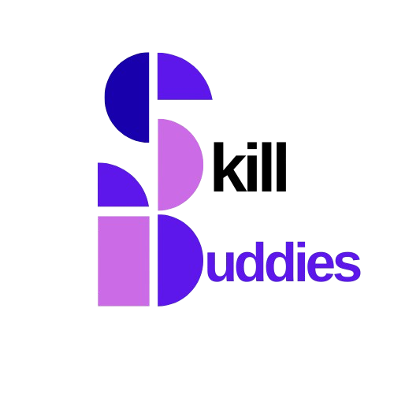

  

<h1 align="center">🤝 Skill Buddies</h1>

A peer-to-peer skill exchange and collaboration platform

---

## 🚀 Features
- 👤 **User Profiles** – Showcase skills you can teach and skills you want to learn  
- 🔍 **Skill Matching** – Find peers based on complementary skill sets  
- 💬 **Direct Messaging / Requests** – Initiate swaps and coordinate learning sessions  
- ⭐ **Reputation System** – Rate and review after a successful swap  
- 📅 **Scheduling** – Manage upcoming learning sessions  

---

## 🛠️ Tech Stack
- **Frontend:** React.js / Next.js, Tailwind CSS  
- **Backend:** Node.js, Express.js  
- **Database:** MongoDB (Mongoose ORM)  
- **Authentication:** JWT / OAuth (Google, GitHub)  
- **Other Tools:** Axios, bcrypt, dotenv  

---

## 📦 Installation & Setup

Clone the repo:

git clone https://github.com/sriyamahapatra/skill-swap.git

cd skill-swap

Install dependencies:

npm install

Set up environment variables (.env):

MONGO_URI=your_mongodb_connection_string

JWT_SECRET=your_secret_key

PORT=5000

Run the development server:

npm run dev

Frontend (if separate):

cd frontend

npm install

npm start

🤝 Contributing
Contributions are welcome!

Fork the project

Create a new branch (git checkout -b feature/your-feature)

Commit changes (git commit -m 'Add new feature')

Push to the branch (git push origin feature/your-feature)

Create a Pull Request

👩‍💻 Author
Built with ❤️ by Sriya Mahapatra
